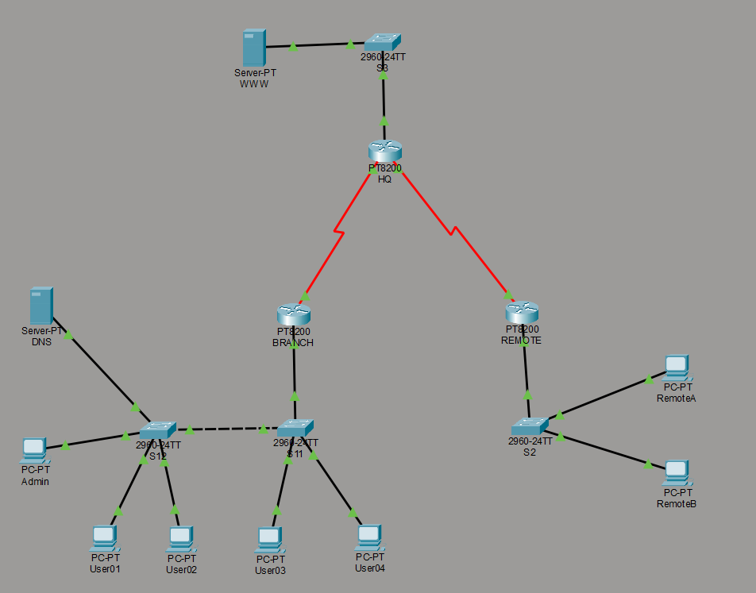

# Lab 01: Podstawowa konfiguracja sieci - Powtórzenie

---

## 🇵🇱 Wersja Polska 

### Opis projektu
Celem laboratorium było odtworzenie i skonfigurowanie kompletnej infrastruktury sieciowej łączącej trzy lokalizacje: **BRANCH**, **HQ** oraz **REMOTE**. Projekt stanowił kompleksowe podsumowanie fundamentów pracy z systemem Cisco IOS.

### Kluczowe zadania i protokoły
* **Segmentacja L2:** Konfiguracja VLAN 10, 20 oraz 99 (Management) na przełącznikach.
* **Inter-VLAN Routing:** Wdrożenie techniki Router-on-a-Stick (subinterfejsy) na routerze BRANCH.
* **Usługi sieciowe:** Konfiguracja routera jako serwera DHCPv4 dla hostów w różnych podsieciach.
* **Routing:** Implementacja statycznych tras domyślnych zapewniających pełną łączność między sieciami LAN 1, LAN 2 i LAN 3.

**Topologia:**

---

## 🇪🇳 English Version 

### Project Description
The goal of this lab was to design and configure a complete network infrastructure connecting three sites: **BRANCH**, **HQ**, and **REMOTE**. This project served as a comprehensive review of Cisco IOS fundamentals.

### Key Tasks & Protocols
* **L2 Segmentation:** Configuration of VLANs 10, 20, and 99 (Management) on switches.
* **Inter-VLAN Routing:** Implementation of Router-on-a-Stick (sub-interfaces) on the BRANCH router.
* **Network Services:** Configuring the router as a DHCPv4 server for hosts across different subnets.
* **Routing:** Implementation of static default routes ensuring full connectivity between LAN 1, LAN 2, and LAN 3.

**Topology:**
