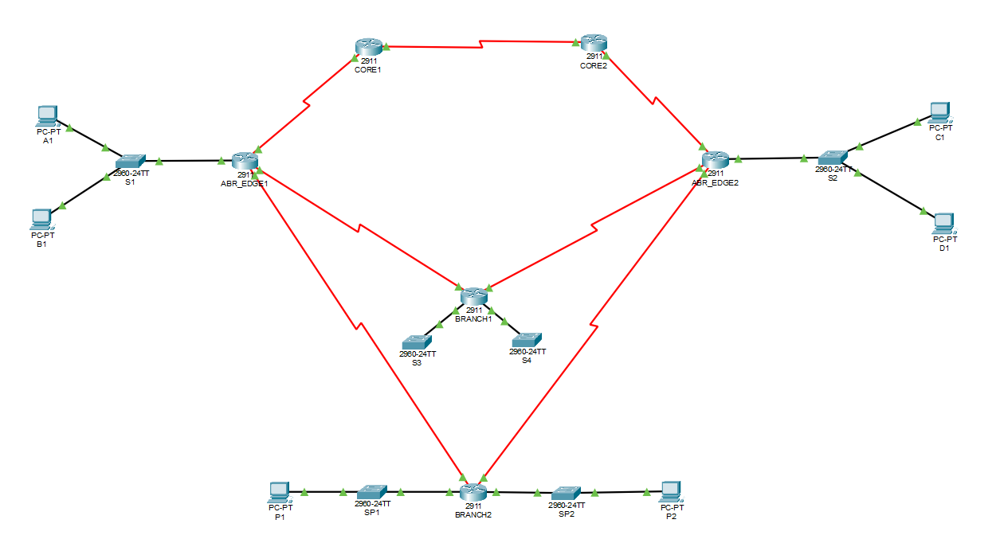

# Lab 03: OSPFv2 Multi-Area & Route Summarization

---

## 🇵🇱 Wersja Polska 

### Opis projektu
Zaawansowany projekt sieciowy wprowadzający strukturę wieloobszarową OSPFv2. Sieć została podzielona na obszar szkieletowy (**Backbone Area 0**) oraz obszary podrzędne (Area 1, 2, 51, 52) w celu zwiększenia skalowalności.

### Kluczowe zadania i protokoły
* **Hierarchia sieci:** Konfiguracja routerów **ABR** (Area Border Router) łączących różne strefy OSPF.
* **Optymalizacja tablic routingu:** Wdrożenie sumaryzacji tras (`area range`) na routerach brzegowych, co znacząco zredukowało liczbę wpisów w tablicach routingu wewnątrz obszarów.
* **Analiza redundancji:** Testowanie zbieżności sieci (convergence) i wyznaczania tras alternatywnych w przypadku symulowanej awarii głównych routerów CORE.

**Topologia:**

---

## 🇬🇧 English Version 

### Project Description
An advanced networking project introducing a multi-area OSPFv2 structure. The network was divided into a **Backbone Area (Area 0)** and subordinate areas (Area 1, 2, 51, 52) to improve scalability and performance.

### Key Tasks & Protocols
* **Network Hierarchy:** Configuration of **ABR** (Area Border Router) nodes linking different OSPF areas.
* **Routing Table Optimization:** Implementing route summarization (`area range`) on border routers, significantly reducing the number of LSA advertisements and routing entries.
* **Redundancy Analysis:** Testing network convergence and alternative path selection during simulated failures of CORE routers.

**Topology:**
