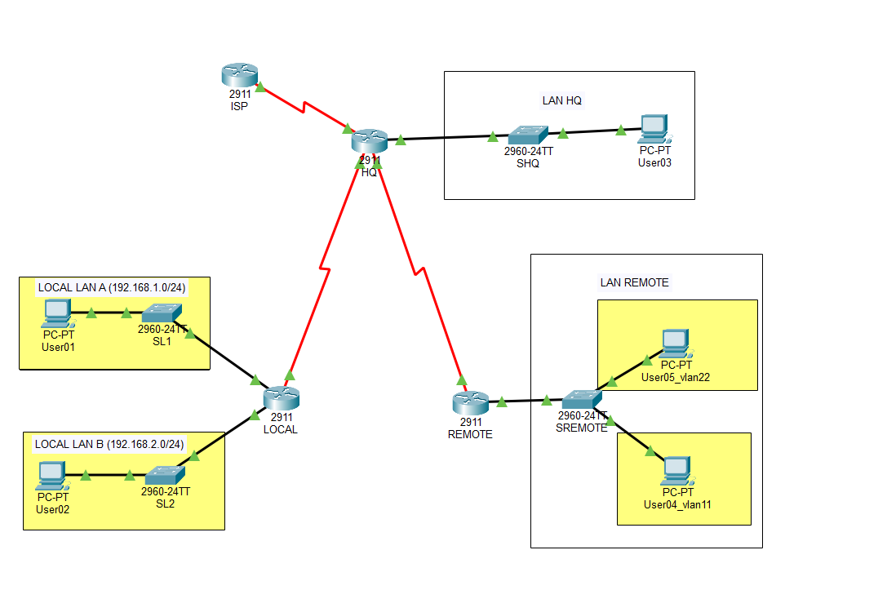

# Lab 04: Standard Access Control Lists (ACLs) & Network Security

---

## 🇵🇱 Wersja Polska 

### Opis projektu
Projekt skupiający się na wdrażaniu podstawowych zasad bezpieczeństwa sieciowego przy użyciu standardowych list kontroli dostępu (Standard ACL). Głównym celem była izolacja ruchu pomiędzy różnymi podsieciami (VLAN-ami) oraz oddziałami, z jednoczesnym zachowaniem dostępu do sieci zewnętrznej (Internet/ISP) oraz serwerów centrali (HQ).

### Kluczowe zadania i protokoły
* **Zabezpieczenie dostępu zdalnego:** Konfiguracja protokołu Telnet oraz wdrożenie listy ACL ograniczającej możliwość logowania do sprzętu sieciowego tylko dla wybranych stacji roboczych administratorów.
* **Izolacja VLAN-ów i oddziałów:** Blokowanie ruchu horyzontalnego pomiędzy podsieciami (np. brak komunikacji między VLAN 11 a VLAN 22) oraz odcięcie komunikacji bezpośredniej między oddziałami LOCAL i REMOTE.
* **Optymalizacja i skalowanie:** Wykorzystanie masek wieloznacznych (wildcard masks, np. `0.0.255.255`) w celu zastąpienia wielu szczegółowych reguł jedną uniwersalną listą ACL blokującą całe klasy adresowe.

**Topologia:**

---

## 🇪🇳 English Version 

### Project Description
A network security project focused on implementing basic security policies using Standard Access Control Lists (ACLs). The primary objective was to isolate traffic between different subnets (VLANs) and branch offices while maintaining access to the external network (Internet/ISP) and headquarters servers (HQ).

### Key Tasks & Protocols
* **Securing Remote Access:** Configuring Telnet and implementing an ACL to restrict device management login solely to designated administrator workstations.
* **VLAN and Branch Isolation:** Blocking horizontal traffic between subnets (e.g., preventing communication between VLAN 11 and VLAN 22) and denying direct branch-to-branch communication (LOCAL to REMOTE).
* **Optimization and Scaling:** Utilizing wildcard masks (e.g., `0.0.255.255`) to replace multiple specific rules with a single, universal ACL that blocks entire address spaces.

**Topology:**
