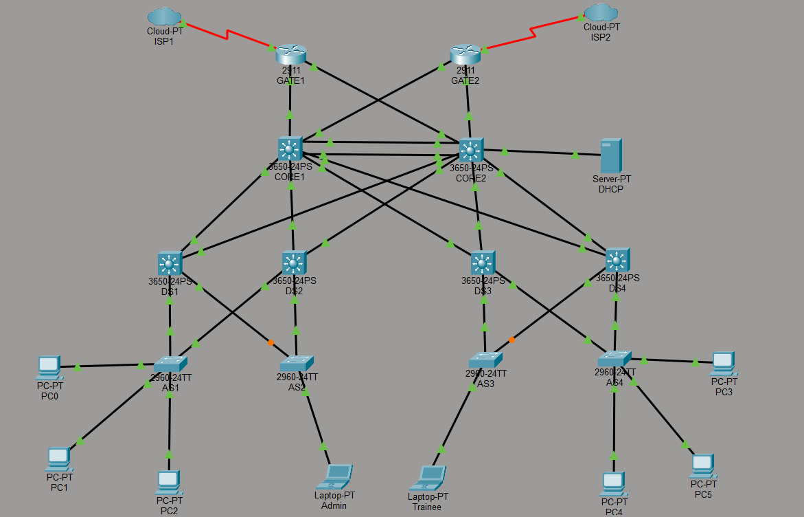

# Lab 09-10: Trójwarstwowa Sieć Korporacyjna (HSRP, OSPFv2, Serwer DHCP & Rozszerzone ACL)

---

## 🇵🇱 Wersja Polska 

### Opis projektu
Kompleksowy projekt trzywarstwowej, hierarchicznej sieci korporacyjnej charakteryzującej się wysoką dostępnością, niezawodnością oraz zaawansowanym bezpieczeństwem. Architektura została podzielona na warstwę dostępu (Access), dystrybucji (Distribution) oraz rdzenia (Core) z aktywnym routingiem dynamicznym i nadmiarowością bram domyślnych.

### Kluczowe zadania i protokoły
* **Architektura Trójwarstwowa:** Integracja przełączników warstwy dostępu (Catalyst 2960), dystrybucji (Catalyst 3650) oraz wielowarstwowego rdzenia (Catalyst 3650) z uruchomionym routingiem IP.
* **Agregacja łączy (EtherChannel):** Spięcie dedykowanych portów pomiędzy przełącznikami CORE w logiczny, wysokoprzepustowy trunk za pomocą protokołu PAgP (`channel-group mode desirable`).
* **Wysoka dostępność (HSRP):** Wdrożenie protokołu redundancji bramy domyślnej z mechanizmem równoważenia obciążenia (Load-Balancing). CORE1 pełni rolę węzła Active dla Budynku X, natomiast CORE2 dla Budynku Y.
* **Automatyzacja adresacji (DHCP Relay):** Konfiguracja centralnego serwera DHCP w wydzielonym VLAN 100, połączona z implementacją funkcji `ip helper-address` na interfejsach wirtualnych (SVI) przełączników rdzenia.
* **Routing Dynamiczny (OSPFv2):** Uruchomienie jednoobszarowego protokołu OSPF area 0 w celu automatycznej wymiany informacji o podsieciach pomiędzy przełącznikami CORE a routerami brzegowymi GATE1 i GATE2, wraz z precyzyjnym spasywowaniem interfejsów klienckich.
* **Bezpieczeństwo i separacja (Rozszerzone ACL):** Implementacja rozszerzonych list kontroli dostępu blokujących bezpośredni ruch między poszczególnymi podsieciami użytkowników (VLAN-ami) przy jednoczesnym zachowaniu dostępu do sieci serwerowej DHCP oraz routerów brzegowych.

**Topologia:**

---

## 🇪🇳 English Version 

### Project Description
A comprehensive design of a three-tier hierarchical enterprise network focusing on high availability, reliability, and advanced security constraints. The architecture is split into Access, Distribution, and Core layers featuring multilayer routing and default gateway redundancy.

### Key Tasks & Protocols
* **Three-Tier Architecture:** Integration of access switches (Catalyst 2960), distribution switches (Catalyst 3650), and a multilayer core (Catalyst 3650) with active IP routing.
* **Link Aggregation (EtherChannel):** Grouping dedicated links between CORE switches into a logical, high-bandwidth trunk utilizing PAgP (`channel-group mode desirable`).
* **First Hop Redundancy (HSRP):** Implementing a default gateway redundancy protocol with active load balancing. CORE1 acts as the Active node for Building X, while CORE2 handles Building Y.
* **Centralized Addressing (DHCP Relay):** Deployment of a dedicated DHCP server within VLAN 100, combined with the configuration of `ip helper-address` on the core switches' virtual interfaces (SVIs).
* **Dynamic Routing (OSPFv2):** Enabling single-area OSPF area 0 to automate route exchange between CORE switches and boundary routers (GATE1, GATE2), alongside strict passive-interface definitions on client segments.
* **Security & Network Isolation (Extended ACLs):** Development of extended access control lists designed to isolate user subnets (VLANs) from each other while keeping connections to the DHCP server infrastructure and gateway nodes intact.

**Topologia:**
