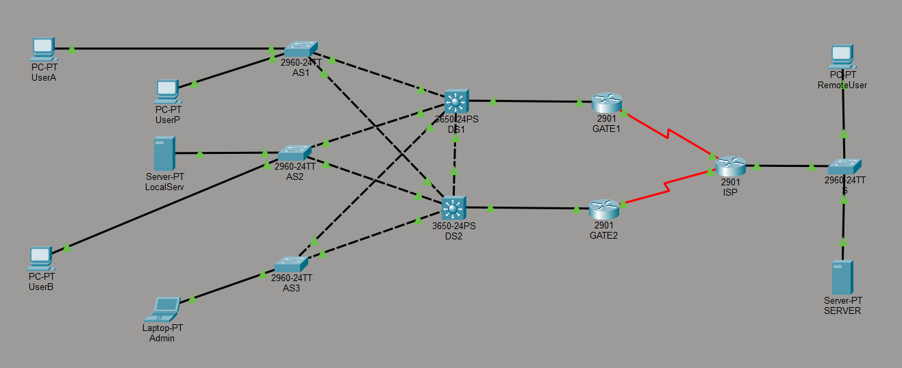

# Lab 11 (oparty na Lab 08): Translacja Adresów Sieciowych (NAT) i Redundancja Bramy (HSRP)

---

## 🇵🇱 Wersja Polska 

### Opis projektu
Zaawansowany projekt integrujący mechanizmy translacji adresów (NAT) z redundantną, hierarchiczną architekturą sieci LAN (Dual-Homed). Scenariusz symuluje podłączenie rozbudowanej sieci korporacyjnej opartej na przełącznikach wielowarstwowych do dostawcy ISP. Rozwiązanie zapewnia wysoką dostępność bramy domyślnej, optymalizację drzewa rozpinającego oraz bezpieczne i w pełni kontrolowane wyjście hostów z adresacją prywatną do globalnej sieci Internet.

### Kluczowe zadania i protokoły
* **NAT Overload (PAT):** Translacja wielu adresów prywatnych na pojedynczy publiczny adres interfejsu WAN (Port Address Translation) w celu optymalizacji użycia publicznej puli adresowej.
* **Port Forwarding (Static NAT):** Bezpieczne udostępnianie zasobów wewnętrznych (serwer WWW w VLAN 22) na świat, poprzez statyczne przekierowanie zapytań z portu 8080 routera WAN na port 80 serwera lokalnego.
* **Precyzyjne ACL (Wykluczenia z NAT):** Modyfikacja list kontroli dostępu (Access Control Lists) w celu przepuszczania ruchu użytkowników do Internetu przy jednoczesnym wykluczeniu z translacji ruchu samego serwera lokalnego.
* **High Availability (HSRP):** Wdrożenie protokołu Hot Standby Router Protocol na routerach brzegowych, w tym przypisanie różnych priorytetów dla poszczególnych sieci VLAN w celu ręcznego równoważenia obciążenia (Load Balancing).
* **Optymalizacja Warstwy 2 (Rapid PVST+):** Konfiguracja protokołu Spanning Tree, obejmująca ręczną elekcję mostów głównych (Root Primary/Secondary) dla konkretnych VLAN-ów, spójną z polityką routingu HSRP.

**Topologia:**

---

## 🇪🇳 English Version 

### Project Description
An advanced project integrating Network Address Translation (NAT) mechanisms with a redundant, hierarchical LAN architecture (Dual-Homed). The scenario simulates connecting an extensive enterprise network based on multilayer switches to an ISP. The solution ensures high availability of the default gateway, spanning tree optimization, and a secure, fully controlled exit for private-addressed hosts to the global Internet.

### Key Tasks & Protocols
* **NAT Overload (PAT):** Translating multiple private addresses into a single public WAN interface address to optimize the use of the public address pool.
* **Port Forwarding (Static NAT):** Securely exposing internal resources (a Web server in VLAN 22) to the outside world via static redirection from the router's WAN port 8080 to the local server's port 80.
* **Precise ACLs (NAT Exclusions):** Modifying Access Control Lists to permit user traffic to the Internet while explicitly excluding the local server's traffic from dynamic translation.
* **High Availability (HSRP):** Implementing the Hot Standby Router Protocol on edge routers, including assigning different priorities for specific VLANs to manually achieve Load Balancing.
* **Layer 2 Optimization (Rapid PVST+):** Configuring the Spanning Tree Protocol, including manual election of Root Bridges (Primary/Secondary) for specific VLANs, keeping it consistent with the HSRP routing policy.

**Topology:**
