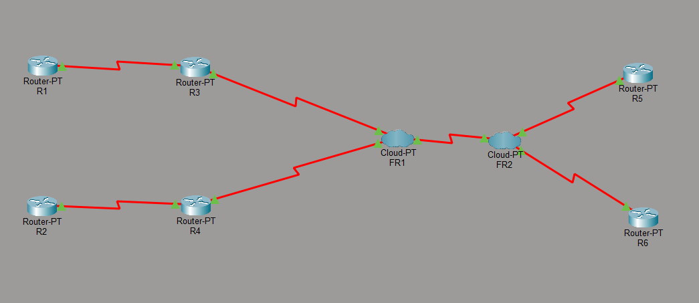

# Lab 12: Technologie WAN (PPP, Frame Relay)

---

## 🇵🇱 Wersja Polska 

### Opis projektu
Projekt skupiający się na konfiguracji klasycznych technologii sieci rozległych (WAN). Scenariusz symuluje środowisko łączące zdalne oddziały korporacyjne przy użyciu dedykowanych łączy szeregowych. Głównym celem było wdrożenie i zabezpieczenie protokołów warstwy łącza danych oraz zbudowanie funkcjonalnej sieci typu NBMA (Non-Broadcast Multi-Access) opartej na przełączaniu ramek, zintegrowanej z routingiem dynamicznym.

### Kluczowe zadania i protokoły
* **Point-to-Point Protocol (PPP):** Konwersja domyślnej enkapsulacji HDLC na łączach szeregowych (Serial) na protokół PPP w celu standaryzacji połączeń punkt-punkt.
* **Uwierzytelnianie CHAP:** Wdrożenie bezpiecznego mechanizmu uwierzytelniania węzłów (Challenge Handshake Authentication Protocol) na łączach PPP w celu autoryzacji komunikacji między routerami.
* **Przełączanie Frame Relay:** Zbudowanie infrastruktury sieci rozległej z wykorzystaniem chmur Frame Relay (WAN Switching). 
* **Mapowanie DLCI i obwody PVC:** Ręczna konfiguracja identyfikatorów DLCI (Data Link Connection Identifier) oraz mapowanie lokalnych adresów IP routerów na odpowiednie wirtualne obwody stałe (PVC) w celu umożliwienia komunikacji wielodostępowej.
* **Integracja OSPF z siecią NBMA:** Uruchomienie jednoobszarowego routingu dynamicznego OSPFv2 w sieci Frame Relay z wymuszeniem trybu `broadcast` na interfejsach szeregowych, co pozwoliło na prawidłowe rozsyłanie pakietów multicastowych Hello i nawiązanie relacji sąsiedztwa między routerami.

**Topologia:**

---

## 🇪🇳 English Version 

### Project Description
A project focused on configuring classic Wide Area Network (WAN) technologies. The scenario simulates an environment connecting remote corporate branches using dedicated serial links. The primary objective was to deploy and secure data link layer protocols and build a functional Non-Broadcast Multi-Access (NBMA) network based on frame switching, seamlessly integrated with dynamic routing.

### Key Tasks & Protocols
* **Point-to-Point Protocol (PPP):** Converting the default HDLC encapsulation on serial links to PPP to standardize point-to-point connections.
* **CHAP Authentication:** Implementing the Challenge Handshake Authentication Protocol (CHAP) on PPP links to securely authorize node-to-node communication.
* **Frame Relay Switching:** Building a WAN infrastructure utilizing Frame Relay clouds (WAN Switching).
* **DLCI Mapping & PVCs:** Manually configuring Data Link Connection Identifiers (DLCIs) and mapping local router IP addresses to appropriate Permanent Virtual Circuits (PVCs) to enable multi-access communication.
* **OSPF Integration over NBMA:** Deploying single-area OSPFv2 dynamic routing across the Frame Relay network by enforcing the `broadcast` network type on serial interfaces. This allowed for proper transmission of multicast Hello packets and the successful formation of neighbor adjacencies.

**Topologia:**
