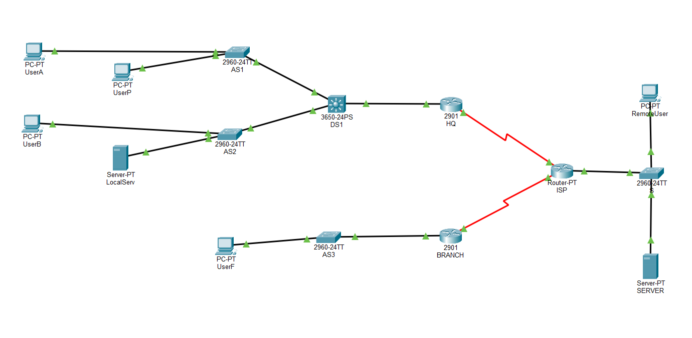

# Lab 13: Tunelowanie GRE i Sieci VPN (Integracja LAN-WAN-LAN)

---

## 🇵🇱 Wersja Polska 

### Opis projektu
Projekt symulujący bezpieczne połączenie dwóch odległych oddziałów firmy (Centrala HQ oraz oddział BRANCH) przez publiczną sieć dostawcy usług (ISP). Głównym celem laboratorium była integracja sieci prywatnych za pomocą wirtualnego tunelu VPN opartego na protokole GRE (Generic Routing Encapsulation), przy jednoczesnym zachowaniu dostępu hostów do globalnej sieci Internet.

### Kluczowe zadania i protokoły
* **Tunelowanie GRE (VPN):** Konfiguracja wirtualnych interfejsów typu `Tunnel` na routerach brzegowych. Hermetyzacja ruchu prywatnego w pakiety protokołu IP pozwalająca na przesyłanie danych nad siecią publiczną bez wiedzy routerów operatora ISP.
* **Integracja OSPF w tunelu:** Uruchomienie jednoobszarowego routingu dynamicznego OSPFv2 z ograniczeniem widoczności procesu **wyłącznie** do interfejsów wewnątrz sieci LAN oraz samego tunelu GRE (izolacja procesu routingu od publicznego Internetu).
* **NAT Overload (PAT):** Równoległe wdrożenie mechanizmów translacji adresów sieciowych (NAT z przeciążeniem) na interfejsach WAN routerów brzegowych, umożliwiających hostom prywatnym wyjście na świat.
* **Analiza Ścieżki (Tracert & PDU):** Praktyczna weryfikacja i śledzenie trasy pakietów. Potwierdzenie, że ruch międzyoddziałowy przechodzi wyłącznie przez węzły o adresach prywatnych, a struktura pakietu odzwierciedla prawidłową enkapsulację IP-GRE-IP.
* **VLAN i Routing Zewnętrzny:** Wdrożenie sieci wirtualnych (VLAN) oraz połączeń w trybie Trunk z wykorzystaniem przełączników wielowarstwowych.

**Topologia:**

---

## 🇪🇳 English Version 

### Project Description
A project simulating a secure connection between two remote corporate branches (HQ and BRANCH) over a public Internet Service Provider (ISP) network. The main objective of the lab was to integrate private networks using a virtual VPN tunnel based on the Generic Routing Encapsulation (GRE) protocol, while maintaining host access to the global Internet.

### Key Tasks & Protocols
* **GRE Tunneling (VPN):** Configuring virtual `Tunnel` interfaces on edge routers. Encapsulating private traffic into IP packets to transmit data across a public network without the knowledge of ISP routers.
* **OSPF Tunnel Integration:** Deploying single-area OSPFv2 dynamic routing restricted **exclusively** to LAN interfaces and the GRE tunnel (isolating the routing process from the public Internet).
* **NAT Overload (PAT):** Parallel implementation of Network Address Translation mechanisms (NAT Overload) on the WAN interfaces of edge routers, enabling private hosts to access the Internet.
* **Path Analysis (Tracert & PDU):** Practical verification and packet tracing. Confirming that inter-branch traffic passes only through private IP nodes and that the packet structure reflects proper IP-GRE-IP encapsulation.
* **VLANs & External Routing:** Implementation of Virtual LANs (VLANs) and Trunk links using multilayer switches.

**Topologia:**
